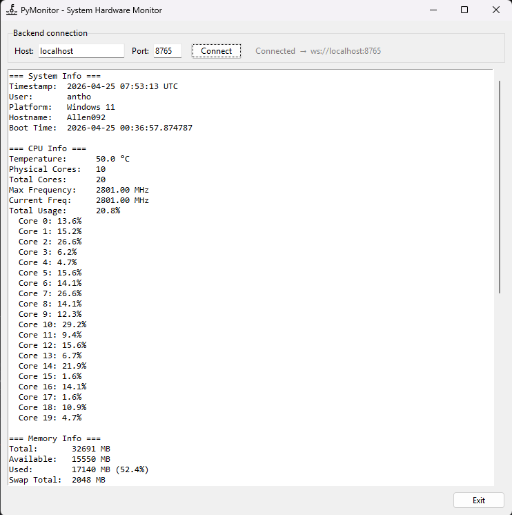
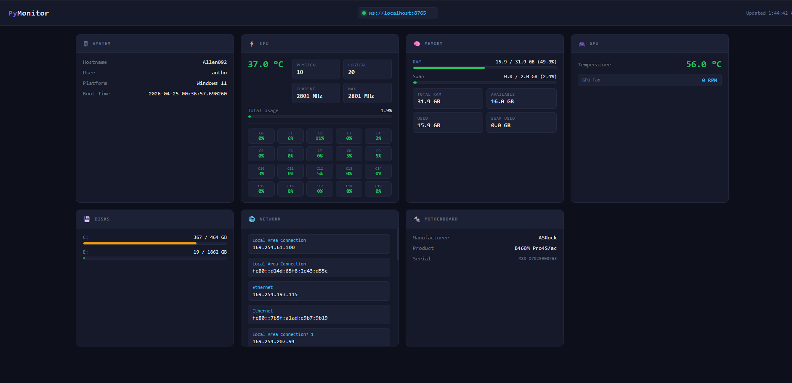

# PyMonitor

A real-time Windows hardware monitor with three interfaces: a **React web dashboard**, a **Python desktop app**, and a shared **TypeScript WebSocket backend** that relays live hardware data between them.

**Desktop app**



**Dashboard**



---

## Architecture

```
┌──────────────────────────────────┐
│  app/  (Python + Tkinter)        │
│                                  │
│  collector.py ──► app.py         │
│  Collects hardware metrics every │
│  2s, displays locally, and       │
│  pushes JSON to the backend.     │
│  Requires Windows + admin.       │
└──────────┬───────────────────────┘
           │  pushes JSON via WebSocket
           ▼
┌──────────────────────────────────┐
│  backend/  (Node.js + TypeScript)│
│                                  │
│  Pure WebSocket relay.           │
│  Tracks the data source (app),   │
│  caches the last payload, and    │
│  broadcasts to all viewers.      │
│  Notifies viewers when the app   │
│  disconnects.                    │
└──────────┬───────────────────────┘
           │  broadcasts JSON via WebSocket
           ▼
┌──────────────────────────────────┐
│  frontend/  (React + Vite)       │
│                                  │
│  Web dashboard on :5173.         │
│  Shows live metrics with gauges, │
│  per-core usage, temperatures,   │
│  and a stale-data banner when    │
│  the app disconnects.            │
└──────────────────────────────────┘
```

The desktop app is the **source of truth**. It collects all hardware metrics and pushes them to the backend. The backend relays data to any connected browser tabs and clears its cache when the app disconnects — so viewers always know whether they are seeing live or stale data.

---

## Repository layout

```
PyMonitor/
├── app/                     # Python desktop client (metric source)
│   ├── assets/
│   │   └── monitor.ico
│   ├── app.py               # UI, WebSocket sender, collection loop
│   ├── collector.py         # Hardware data collection module
│   ├── requirements.txt
│   └── settings.json        # Auto-generated, stores last-used host/port
│
├── backend/                 # TypeScript WebSocket relay
│   ├── src/
│   │   └── server.ts
│   ├── package.json
│   └── tsconfig.json
│
├── frontend/                # React + Vite web dashboard
│   ├── src/
│   │   ├── App.tsx
│   │   ├── App.css
│   │   ├── types.ts
│   │   ├── vite-env.d.ts
│   │   └── main.tsx
│   ├── nginx.conf           # Production nginx config (used by Docker)
│   ├── index.html
│   ├── package.json
│   └── tsconfig.json
│
├── Dockerfile.backend       # Multi-stage build for the relay server
├── Dockerfile.frontend      # Multi-stage build → nginx static serving
├── docker-compose.yml       # Starts backend + frontend together
├── package.json             # Root scripts to start everything at once
├── .gitignore
├── LICENSE
└── README.md
```

---

## Prerequisites

| Requirement | Version | Notes |
|---|---|---|
| Windows | 10 / 11 | Hardware APIs are Windows-only |
| Python | 3.10+ | For `app/` |
| Node.js | 18+ | For `backend/` and `frontend/` (not needed if using Docker) |
| npm | 9+ | Bundled with Node.js |
| Docker + Compose | 24+ | Optional — for containerised backend + frontend |

> **Admin privileges required** — temperature sensors and fan speeds need elevated access. Run the desktop app as administrator (it will prompt automatically).

---

## Quick start

### Option A — Docker (recommended for deployment)

Starts the backend and frontend in containers with a single command. No Node.js install required.

```sh
docker compose up --build
```

| Service | Address |
|---|---|
| Web dashboard | `http://localhost:5173` |
| WebSocket relay | `ws://localhost:8765` |

Run in the background with `docker compose up --build -d`, stop with `docker compose down`.

Then launch the desktop app on the host machine (Docker cannot run it — it needs Windows hardware APIs):

```sh
cd app
pip install -r requirements.txt
python app.py
```

---

### Option B — Start everything at once (no Docker)

From the repo root:

```sh
# First time only
npm install            # installs concurrently
npm run install:all    # installs backend + frontend deps

npm run build:all      # compiles TypeScript

npm start              # starts backend + frontend together
```

Then launch the desktop app separately (it needs its own terminal as admin):

```sh
cd app
pip install -r requirements.txt
python app.py
```

Use `npm run dev` instead of `npm start` to skip the build step during development.

---

### Option C — Start each piece individually

**1 — Backend**

```sh
cd backend
npm install
npm run build
npm start              # ws://0.0.0.0:8765
```

**2 — Frontend**

```sh
cd frontend
npm install
npm run dev            # http://localhost:5173
```

**3 — Desktop app** (run as administrator)

```sh
cd app
pip install -r requirements.txt
python app.py
```

---

## Configuration

No config files. Each client manages its own connection settings:

| Client | How to set the backend URL |
|---|---|
| **Desktop app** | Host and Port fields in the connection bar at the top of the window. Settings are saved to `app/settings.json` between launches. |
| **Web dashboard** | Click the URL displayed in the header to edit it inline. Saved to `localStorage` in the browser. |
| **Backend port** | Set the `PORT` environment variable: `PORT=9000 npm start` |

For LAN access, set the host to the machine's local IP (e.g. `192.168.1.100`). The backend always binds to `0.0.0.0` so it is reachable from other devices on the network.

---

## Metrics collected

| Section | Data points |
|---|---|
| **System** | Hostname, user, platform, boot time |
| **CPU** | Temperature, per-core usage %, current / max frequency, fan RPM |
| **Memory** | RAM used / total, swap used / total |
| **GPU** | Temperature, fan RPM |
| **Disks** | Per-drive used / free GB |
| **Network** | Interface names and IP addresses |
| **Battery** | Charge %, plugged-in status (shown only if battery present) |
| **Motherboard** | Manufacturer, product, serial number |

Temperature and fan data require the [`HardwareMonitor`](https://pypi.org/project/HardwareMonitor/) package and admin privileges. All other metrics use `psutil` and `wmi`.

---

## Disconnection behaviour

When the desktop app is closed:

- The backend detects the source client disconnecting, clears its payload cache, and broadcasts a `source_disconnected` signal to all viewers.
- The web dashboard dims the last known data and shows a yellow banner: **"Desktop app disconnected — showing last known data"**.
- When the app reconnects and starts pushing metrics again, the banner disappears and the dashboard returns to normal.

The backend and frontend can remain running independently — they just wait for the app to reconnect.

---

## Development notes

### Adding a new metric

1. Add a `get_<metric>()` function in `app/collector.py` that returns a JSON-serialisable value.
2. Include it in the `collect_all()` dict.
3. Add the corresponding TypeScript interface in `frontend/src/types.ts`.
4. Render a new card in `frontend/src/App.tsx` and a new section in `app/app.py`.

### Frontend hot reload

Vite's dev server (`npm run dev`) reloads on every file save. The WebSocket connection is managed in a `useEffect` and survives hot reloads without reconnecting.

### Changing the backend port

Set `PORT` as an environment variable when starting the backend. Then update the URL in the desktop app's connection bar and the browser's header input to match.

---

## License

MIT © Anthony Mora — see [LICENSE](LICENSE).
